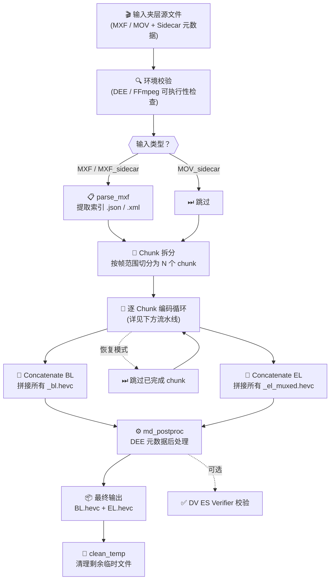
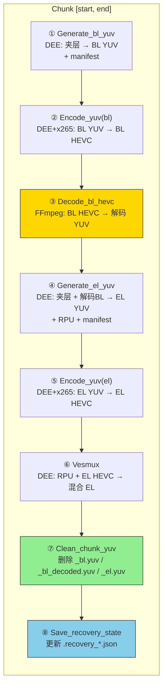
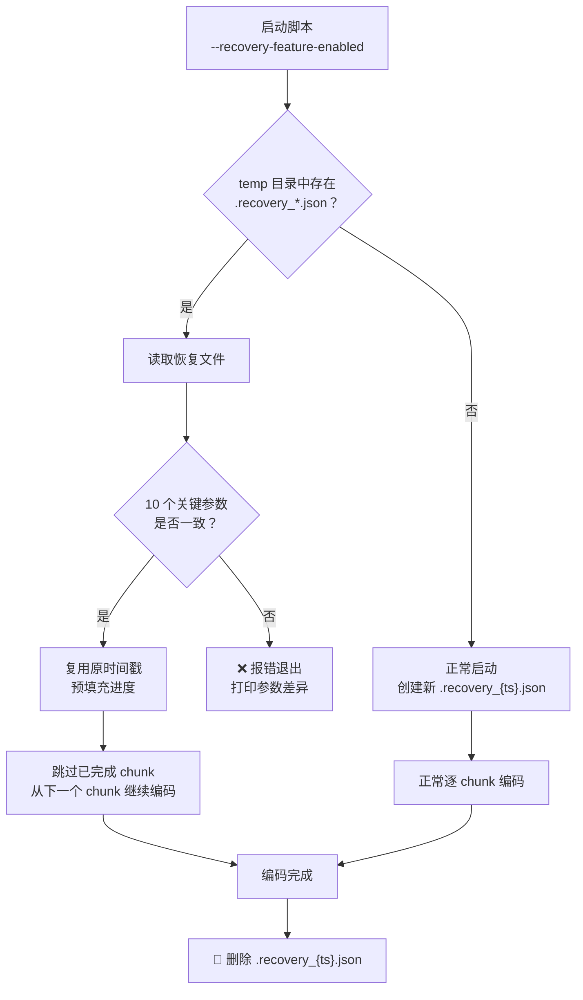
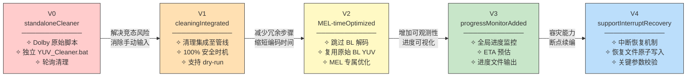
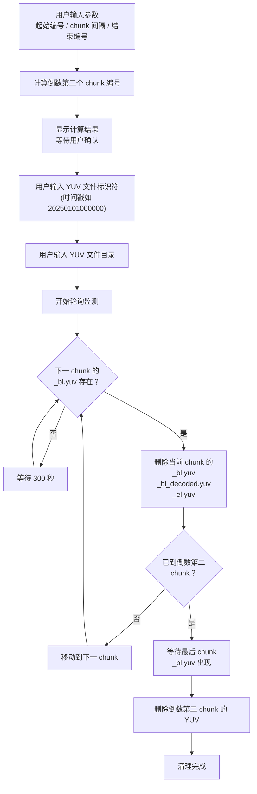

# 杜比编码引擎工作流 (DEE Workflow)

基于 Dolby Encoding Engine 的 **Dolby Vision Profile 7 双层分布式编码工作流**。本项目在 Dolby 官方 `dv_profile_7_workflow_chunked.py` 示例脚本基础上，针对 UHD 蓝光编码场景进行了五轮递进式增强——从独立 YUV 清理工具、清理逻辑集成、MEL 性能优化、全局进度监控到意外中断恢复，最终形成一套面向实际生产环境的完整编码管线。

---

## 目录

- [依赖组件](#依赖组件)
- [项目结构](#项目结构)
- [核心编码流程](#核心编码流程)
  - [整体流程图](#整体流程图)
  - [Chunk 内部 6 步流水线](#chunk-内部-6-步流水线)
  - [处理时序示例](#处理时序示例)
- [版本演进](#版本演进)
  - [总述](#总述)
  - [V0 — 独立清理器 (standaloneCleaner)](#v0--独立清理器-standalonecleaner)
  - [V1 — 清理逻辑集成 (cleaningIntegrated)](#v1--清理逻辑集成-cleaningintegrated)
  - [V2 — MEL 性能优化 (MEL-timeOptimized)](#v2--mel-性能优化-mel-timeoptimized)
  - [V3 — 进度监控 (progressMonitorAdded)](#v3--进度监控-progressmonitoradded)
  - [V4 — 中断恢复 (supportInterruptRecovery)](#v4--中断恢复-supportinterruptrecovery)
  - [总结：版本演进一览](#总结版本演进一览)
- [YUV_Cleaner.bat 工作机制](#yuv_cleanerbat-工作机制)
- [调用参数参考](#调用参数参考)
- [快速开始](#快速开始)
- [许可证](#许可证)

---

## 依赖组件

| 组件 | 版本 | 用途 |
|:---|:---|:---|
| **Dolby Encoding Engine (DEE)** | 5.2.1 | 杜比视界双层编码核心引擎，负责 BL/EL YUV 生成、HEVC 编码调度、VES 复用、元数据后处理 |
| **FFmpeg** | 7.1.1-full_build-www.gyan.dev | HEVC 解码器，将 BL HEVC 码流解码为原始 YUV 供 EL 生成步骤使用 |
| **Python** | 3.13.7 | 工作流编排脚本运行时，管理 chunk 拆分、步骤调度、临时文件追踪与清理 |
| **x265** | 3.5 | HEVC 编码器，由 DEE 通过 XML 模板调用，完成 BL/EL 两层的实际 HEVC 编码 |

---

## 项目结构

```
DEE_Workflow/
├── Encoder.bat                  ← 一键启动脚本（当前版本 V4，含全部优化参数）
├── Progress.txt                 ← 进度监控输出文件（由 --progress-monitor 写入）
├── README.md                    ← 本文档
├── Settings/                    ← 各组件配置文件的快捷方式
│   ├── Settings_pyScript.lnk    → Python 脚本位置
│   ├── Settings_x265_BL.lnk    → BL 层 x265 编码模板
│   ├── Settings_x265_EL.lnk    → EL 层 x265 编码模板
│   ├── Settings_YUV_BL.lnk     → BL 层 YUV 生成模板
│   └── Settings_YUV_EL.lnk     → EL 层 YUV 生成模板
└── backup/                      ← 各版本备份（含完整脚本与目录结构快照）
    ├── 0_standaloneCleaner/     → V0：Dolby 原始脚本 + 独立清理器
    ├── 1_cleaningIntegrated/    → V1：清理逻辑集成
    ├── 2_MEL-timeOptimized/     → V2：MEL 性能优化
    ├── 3_progressMonitorAdded/  → V3：进度监控
    └── 4_supportInterruptRecovery/ → V4：中断恢复
```

---

## 核心编码流程

### 整体流程图



### Chunk 内部 6 步流水线

对每个 chunk（如 `[0, 599]`），按以下流水线顺序处理：



> **注**：启用 `--optimize-mel-performance` 时，步骤 ③ 被跳过，步骤 ④ 直接复用 `_bl.yuv` 替代 `_bl_decoded.yuv`。
>
> **注**：步骤 ⑧ 始终执行（无论是否启用 `--recovery-feature-enabled`），确保恢复文件随时可供中断恢复使用。

### 处理时序示例

以 **3600 帧视频、chunk=600、gop=60** 为例（产生 6 个 chunk）：

```
时间轴 ──────────────────────────────────────────────────────────►

[环境校验] sanity_check_dee + sanity_check_ffmpeg
[记录启动时间] Record_start_time                                   ← V3 新增
[初始化恢复文件] RecoveryManager.init_new / try_load               ← V4 新增

── Chunk 1 [0, 599] ──────────────────────────────────────────────
  ① Generate_bl_yuv      → {ts}_0_599_bl.yuv + _bl_manifest.xml
  ② Encode_yuv(bl)       → {ts}_0_599_bl.hevc
  ③ Decode_bl_hevc       → {ts}_0_599_bl_decoded.yuv              ← MEL 优化时跳过
  ④ Generate_el_yuv      → {ts}_0_599_el.yuv + _el.rpu + _el_manifest.xml
  ⑤ Encode_yuv(el)       → {ts}_0_599_el.hevc
  ⑥ Vesmux               → {ts}_0_599_el_muxed.hevc
  ⑦ Clean_chunk_yuv      ✗ 删除 _0_599_bl.yuv, _bl_decoded.yuv, _el.yuv
  [更新进度] 16.7%                                                 ← V3 新增
  [保存恢复状态] Save_recovery_state → .recovery_{ts}.json          ← V4 新增

── Chunk 2 [600, 1199] ──────────────────────────────────────────
  ① Generate_bl_yuv      → {ts}_600_1199_bl.yuv
  ② Encode_yuv(bl)       → {ts}_600_1199_bl.hevc
  ③ Decode_bl_hevc       → {ts}_600_1199_bl_decoded.yuv
  ④ Generate_el_yuv      → {ts}_600_1199_el.yuv + _el.rpu
  ⑤ Encode_yuv(el)       → {ts}_600_1199_el.hevc
  ⑥ Vesmux               → {ts}_600_1199_el_muxed.hevc
  ⑦ Clean_chunk_yuv      ✗ 删除 YUV 文件
  [更新进度] 33.3%
  [保存恢复状态]                                                    ← V4 新增

── Chunk 3 [1200, 1799] ─────────────────────────────────────────
  ... (同上流水线)
  [更新进度] 50.0%

── Chunk 4 [1800, 2399] ─────────────────────────────────────────
  ... (同上流水线)
  [更新进度] 66.7%

── Chunk 5 [2400, 2999] ─────────────────────────────────────────
  ... (同上流水线)
  [更新进度] 83.3%

── Chunk 6 [3000, 3599] ─────────────────────────────────────────
  ... (同上流水线)
  [更新进度] Done.
  [保存恢复状态]                                                    ← V4 新增

[拼接] Concatenate_chunk_files('bl')  → {ts}_bl_concat.hevc
[拼接] Concatenate_chunk_files('el')  → {ts}_el_concat.hevc
[后处理] md_postproc                  → 最终 BL.hevc + EL.hevc
[删除恢复文件] RecoveryManager.remove → ✗ .recovery_{ts}.json       ← V4 新增
[清理] clean_temp                     ✗ 删除剩余所有中间文件
```

> **磁盘占用示意**：对于 4K 10bit YUV420，每个 chunk 600 帧会产生约 **9 GB** 的 YUV 中间文件（`_bl.yuv` + `_bl_decoded.yuv` + `_el.yuv`）。及时清理使得磁盘峰值占用从 $N \times 9\text{GB}$ 降至约 $1 \times 9\text{GB}$。

---

## 版本演进

### 总述

本项目经历了五个迭代版本，每一版都精准解决了上一版遗留的核心痛点，沿着 **"安全 → 高效 → 可观测 → 可恢复"** 的主线持续演进：

| 痛点 | 解决方案 | 引入版本 |
|:---|:---|:---|
| YUV 中间文件体积巨大，编码长视频时磁盘空间不足 | 独立 bat 轮询清理 | V0 |
| bat 轮询机制脆弱、需手动输入参数、存在竞态风险 | 清理逻辑集成至 Python 工作流 | V1 |
| MEL 场景 BL 解码步骤冗余，浪费编码时间 | `--optimize-mel-performance` 跳过解码 | V2 |
| 长时间编码缺乏进度感知，无法预估完成时间 | `--progress-monitor` 全局进度文件输出 | V3 |
| 意外中断（断电/崩溃）后需从头重新编码 | `--recovery-feature-enabled` 中断恢复 | V4 |

---

### V0 — 独立清理器 (standaloneCleaner)

**优化目标**：解决编码过程中 YUV 中间文件占满磁盘的问题。

**方案**：在 Dolby 原始 `dv_profile_7_workflow_chunked.py` 之外，提供独立的 `YUV_Cleaner.bat` 脚本，作为并行进程运行，自动监测并删除已处理完毕的 chunk 的 YUV 文件。

**目录结构**：
```
ROOT_DIRECTORY_STRUCTURE/
├── Encoder_x265.bat       ← 调用 Python 脚本的启动器
├── YUV_Cleaner.bat        ← 独立 YUV 清理工具（需单独运行）
├── Settings_pyScript.lnk
├── Settings_x265_BL.lnk
├── Settings_x265_EL.lnk
├── Settings_YUV_BL.lnk
└── Settings_YUV_EL.lnk
```

**调用参数**（Encoder_x265.bat）：
```bat
python dv_profile_7_workflow_chunked.py ^
  --print-all --dee dee.exe --dee-license license.lic ^
  --ffmpeg ffmpeg.exe --use-case no_mapping_with_mel ^
  --input DoVi_Mezz_ProRes.mov --metadata DoVi_Meta_CMv4.0.xml ^
  --input-type mov_sidecar --fps 59.94 --gop-size 60 ^
  --temp X:\DolbyEncodingEngineTemp --encode-pass-num 2 ^
  --start 0 --end <N> --chunk 600 --preset slower ^
  --base-layer DoViMezzBL.hevc --enh-layer DoViMezzEL.hevc
```

**输入输出**：

| 输入 | 输出 |
|:---|:---|
| 夹层源文件（MOV/MXF） + 元数据 XML | BL HEVC 码流 + EL HEVC 码流 |

**关键局限**：`YUV_Cleaner.bat` 需作为独立进程并行运行，通过轮询文件系统检测编码进度，存在竞态风险（详见 [YUV_Cleaner.bat 工作机制](#yuv_cleanerbat-工作机制)）。

---

### V1 — 清理逻辑集成 (cleaningIntegrated)

**优化目标**：消除 V0 中 bat 脚本与 Python 工作流之间缺乏同步的架构缺陷，将 YUV 清理变为编码管线内的原子步骤。

**核心改动（4 处）**：

| 改动 | 说明 |
|:---|:---|
| `FileManager.remove_from_tracking()` | 新增方法，已清理文件从追踪列表移除，避免 `clean_temp()` 重复操作 |
| `Clean_chunk_yuv` 类 | 每个 chunk 的 Vesmux 完成后执行，删除 `_bl.yuv`、`_bl_decoded.yuv`、`_el.yuv` |
| `Print_clean_chunk_yuv` 类 | `--dry-run` 模式下打印待清理文件路径 |
| `Workflow` 步骤编排 | 在每个 chunk 的 Vesmux 后插入清理步骤 |

**V0 vs V1 清理机制对比**：

| 方面 | V0 bat（外部轮询） | V1 集成（管线内步骤） |
|:---|:---|:---|
| 清理时机 | 检测到**下一** chunk 的 `_bl.yuv` 存在时 | **当前** chunk 的 Vesmux 完成后**立即**执行 |
| 安全性 | 间接推断，有竞态风险 | 100% 确定，所有 YUV 消费者均已完成 |
| 参数输入 | 手动输入起始编号、间隔、结束编号 | 全自动，复用命令行参数 |
| `--keep-temp` | 不支持 | 完整支持 |
| `--dry-run` | 不支持 | 通过 Print 类支持 |
| 独立进程 | 需要 | 不需要 |

**调用参数**：与 V0 相同（`YUV_Cleaner.bat` 不再需要）。

**输入输出**：与 V0 相同。

---

### V2 — MEL 性能优化 (MEL-timeOptimized)

**优化目标**：在 MEL（Minimum Enhancement Layer）模式下，EL 码率极低（500 kbps），BL 解码→再编码的往返损失可忽略不计，通过跳过冗余的 `Decode_bl_hevc` 步骤来缩短编码时间。

**核心改动（4 处）**：

| 改动 | 说明 |
|:---|:---|
| `--optimize-mel-performance` 参数 | 新增布尔开关 |
| `Config.validate_parsing()` | 运行时校验：该选项仅限 use-case 包含 `mel` 时使用 |
| `Workflow.get_run_dry_steps()` | 启用该选项时跳过 `Decode_bl_hevc` 步骤 |
| `Generate_el_yuv.__call__()` | 输入从 `_bl_decoded.yuv` 改为复用 `_bl.yuv` |

**流水线对比**：

```
默认模式（FEL / 未启用优化）:          --optimize-mel-performance:
  ① Generate_bl_yuv  → _bl.yuv       ① Generate_bl_yuv  → _bl.yuv
  ② Encode_yuv(bl)   → _bl.hevc      ② Encode_yuv(bl)   → _bl.hevc
  ③ Decode_bl_hevc   → _bl_decoded   ██ 跳过 ██
  ④ Generate_el_yuv  ← _bl_decoded   ④ Generate_el_yuv  ← _bl.yuv (复用)
  ⑤ Encode_yuv(el)   → _el.hevc      ⑤ Encode_yuv(el)   → _el.hevc
  ⑥ Vesmux           → _el_muxed     ⑥ Vesmux           → _el_muxed
  ⑦ Clean_chunk_yuv                   ⑦ Clean_chunk_yuv
```

**MEL vs FEL 码率参数**：

| 参数 | BL（两者相同） | EL（MEL） | EL（FEL） |
|:---|:---|:---|:---|
| `data_rate` | 85,000 kbps | 500 kbps | 15,000 kbps |
| `max_vbv_data_rate` | 85,000 kbps | 500 kbps | 15,000 kbps |
| `vbv_buffer_size` | 93,500 kbps | 550 kbps | 16,500 kbps |

**调用参数新增**：
```bat
--optimize-mel-performance
```

**输入输出**：与 V1 相同。额外节省了每个 chunk 的 FFmpeg 解码时间和 `_bl_decoded.yuv` 的磁盘 I/O。

---

### V3 — 进度监控 (progressMonitorAdded)

**优化目标**：为长时间编码任务（UHD 蓝光影片常需数小时至数十小时）提供全局进度感知，包括完成百分比、已用时间、预计完成时间。

**核心改动（6 处）**：

| 改动 | 说明 |
|:---|:---|
| `import math` | 用于有效数字格式化 |
| `--progress-monitor` 参数 | 指定进度文件输出路径（`action=toAbsolutePath`，相对于 bat 工作目录解析） |
| `ProgressMonitor` 类 | 管理进度统计：记录起始时间、计算已处理比例、推算 ETA |
| `Record_start_time` / `Update_progress` | 实际运行步骤类 |
| `Print_record_start_time` / `Print_update_progress` | dry-run 占位类 |
| `Workflow` 步骤编排 | 首个 chunk 前插入 `Record_start_time`，每个 chunk 后追加 `Update_progress` |

**进度文件输出格式**（`Progress.txt`）：

```
Global Progress Monitor - (C) LumaVista
---------------------------------------
* Updated with the last finished chunk.

Global Progress: 33.3%
Time Elapsed: 01:23:45

Encoder Start Time: 2026/03/30 14:00:00
Estimated End Time: 2026/03/30 18:11:15
```

**Global Progress 格式化规则**：

| 条件 | 格式 | 示例 |
|:---|:---|:---|
| $pct < 1\%$ | 两位小数 | `0.12%`、`0.50%` |
| $1\% \le pct < 100\%$ | 三位有效数字 | `1.23%`、`12.3%`、`99.9%` |
| $pct = 100\%$ | 替换为文本 | `Done.` |

**ETA 计算**：假设后续 chunk 的处理速度等于之前所有 chunk 的**平均**处理速度（含 chunk 间的间隙开销），公式为：

$$T_{\text{remaining}} = \frac{F_{\text{total}} - F_{\text{processed}}}{F_{\text{processed}} / T_{\text{elapsed}}}$$

**调用参数新增**：
```bat
--progress-monitor ".\Progress.txt"
```

**输入输出**：编码输入输出不变，额外产出 `Progress.txt` 进度文件。

---

### V4 — 中断恢复 (supportInterruptRecovery)

**优化目标**：UHD 蓝光编码常持续数小时至数十小时，期间可能遭遇意外断电、系统崩溃或用户误关闭等中断情况。V4 引入中断恢复机制，使脚本能够从最后一个**完整完成**的 chunk 处继续编码，避免从头重新开始。

**核心改动（7 处）**：

| 改动 | 说明 |
|:---|:---|
| `import json` / `import glob` | 用于恢复文件的序列化与发现 |
| `RECOVERY_CRITICAL_PARAMS` | 定义恢复时必须匹配的 10 个关键参数列表 |
| `--recovery-feature-enabled` 参数 | 新增布尔开关，启用后尝试读取恢复文件 |
| `RecoveryManager` 类 | 管理 `.recovery_<timestamp>.json` 的创建、读取、更新和删除 |
| `Save_recovery_state` / `Print_save_recovery_state` | 每个 chunk 所有编码任务完成后写入恢复状态 |
| `Skip_chunk` / `Print_skip_chunk` | 恢复时跳过已完成的 chunk |
| `Workflow` 步骤编排 | 每个 chunk 末尾追加 `Save_recovery_state`；恢复时将已完成 chunk 的全部步骤替换为 `Skip_chunk` |

**恢复文件（`.recovery_<timestamp>.json`）**：

恢复文件**始终生成**（无论是否传入 `--recovery-feature-enabled`），确保任何中断后都可恢复。仅当传入该参数时才尝试读取。

文件内容示例：
```json
{
  "time_stamp": "20260330140000",
  "critical_params": {
    "use_case": "no_mapping_with_mel",
    "optimize_mel_performance": true,
    "start": 0,
    "end": 3599,
    "chunk": 600,
    "fps": "59.94",
    "gop_size": 60,
    "encode_pass_num": 2,
    "preset": "slower",
    "temp": "X:\\DolbyEncodingEngineTemp"
  },
  "completed_chunks": [[0, 599], [600, 1199]]
}
```

**恢复时的参数校验**：

以下 10 个参数必须与中断运行时完全一致，否则报错退出：

| 参数 | 说明 |
|:---|:---|
| `use_case` | 编码用例类型 |
| `optimize_mel_performance` | MEL 优化开关 |
| `start` / `end` | 编码帧范围 |
| `chunk` | chunk 大小 |
| `fps` | 帧率 |
| `gop_size` | GOP 大小 |
| `encode_pass_num` | 编码 pass 数 |
| `preset` | 编码器预设 |
| `temp` | 临时文件目录 |

其余参数（如 `--input`、`--dee`、`--ffmpeg` 等路径参数）以**本次运行**的值为准，允许不一致。

**安全性设计**：

| 设计决策 | 说明 |
|:---|:---|
| **写入时机** | 仅当当前 chunk 的**全部**编码步骤（含 Vesmux、YUV 清理、进度更新）完成后才更新恢复文件 |
| **原因** | 即使中断时所有输出文件都已存在，也可能尚未被完整写入；仅记录上一个确认完成的 chunk |
| **原子写入** | 先写 `.tmp` 临时文件再 rename，避免写入过程中断导致恢复文件损坏 |
| **时间戳复用** | 恢复时复用中断运行的时间戳，确保 `FileManager` 生成的文件名与已有中间文件一致 |
| **进度预填充** | 恢复时将已完成 chunk 的帧数预填充到 `ProgressMonitor.processed_frames`，保持进度百分比连续 |
| **完成后清理** | 编码全部成功完成后自动删除恢复文件 |

**中断恢复流程**：



**调用参数新增**：
```bat
--recovery-feature-enabled
```

**输入输出**：编码输入输出不变，额外在 temp 目录中维护 `.recovery_<timestamp>.json` 恢复文件（编码成功后自动删除）。

---

### 总结：版本演进一览



**每个版本的新增参数汇总**：

| 版本 | 新增命令行参数 | 新增类/方法 | 解决的核心痛点 |
|:---|:---|:---|:---|
| V0 | —（Dolby 原始参数集） | —（+ 独立 bat） | YUV 磁盘溢出 |
| V1 | — | `Clean_chunk_yuv`、`Print_clean_chunk_yuv`、`FileManager.remove_from_tracking()` | bat 轮询竞态、手动输入 |
| V2 | `--optimize-mel-performance` | — (修改 `Workflow` + `Generate_el_yuv`) | MEL 模式冗余解码 |
| V3 | `--progress-monitor FILE` | `ProgressMonitor`、`Record_start_time`、`Update_progress`、`Print_record_start_time`、`Print_update_progress` | 长任务进度盲区 |
| V4 | `--recovery-feature-enabled` | `RecoveryManager`、`Save_recovery_state`、`Skip_chunk`、`Print_save_recovery_state`、`Print_skip_chunk` | 意外中断需从头重编 |

---

## YUV_Cleaner.bat 工作机制

`YUV_Cleaner.bat` 是 V0 阶段设计的独立 YUV 中间文件清理工具，作为解决编码过程磁盘空间不足的初始方案。

### 运行模式

`YUV_Cleaner.bat` 需**与 Python 编码脚本同时运行**，作为独立的 CMD 窗口进程。它通过文件系统轮询来推断编码进度，并在安全时删除已完成 chunk 的 YUV 文件。

### 工作流程



### 检测逻辑

bat 脚本的核心判据是：**当下一个 chunk 的 `_bl.yuv` 文件出现时**，推断当前 chunk 的所有 YUV 消费步骤已经完成。这是因为在顺序执行的工作流中，只有当前 chunk 的全部 6 个步骤（包括 Vesmux）执行完毕后，才会开始下一个 chunk 的 `Generate_bl_yuv`（即产生下一个 `_bl.yuv`）。

### 参数输入示例

```
以文件名 20250101000000_0_599_bl.yuv 为例：
  起始编号 (Starting number) = 599      （第一个 chunk 的结束帧号）
  间隔长度 (Interval length) = 600      （chunk 大小）
  结束编号 (Ending number) = 3599       （最后一帧的帧号）
  标识符 (Identifier) = 20250101000000  （时间戳前缀）
```

### 已知局限

| 问题 | 说明 |
|:---|:---|
| **轮询间隔固定** | 300 秒硬编码，需用户根据编码速度手动调整 |
| **无同步机制** | 通过文件存在性间接推断进度，与 Python 进程无锁同步 |
| **手动参数输入** | 需用户计算 chunk 编号参数，容易出错 |
| **倒数第二 chunk 计算偏差** | `calculateFinalNumber` 循环在溢出时减去 `intervalLength*2`，某些边界条件下计算结果可能偏移 |
| **最后 chunk 不清理** | 最后一个 chunk 的 YUV 留给 `clean_temp()` 处理 |

> 这些局限在 **V1** 中通过将清理逻辑集成至 Python 工作流内部得到了完全解决。

---

## 调用参数参考

### 必选参数

| 参数 | 说明 | 示例 |
|:---|:---|:---|
| `-u, --use-case` | 编码用例 | `no_mapping_with_mel` |
| `-t, --input-type` | 输入类型 | `mov_sidecar` |
| `-l, --dee-license` | DEE 许可证文件 | `license.lic` |
| `-i, --input` | 输入夹层源文件 | `DoVi_Mezz_ProRes.mov` |
| `-g, --gop-size` | GOP 大小（帧数） | `60` |
| `-e, --enh-layer` | 输出 EL 码流路径 | `DoViEL.hevc` |
| `-d, --dee` | DEE 可执行文件 | `dee.exe` |
| `-c, --chunk` | Chunk 大小（帧数） | `600` |
| `-b, --base-layer` | 输出 BL 码流路径 | `DoViBL.hevc` |
| `--temp` | 临时文件目录 | `X:\DolbyEncodingEngineTemp` |
| `--start` | 起始帧号 | `0` |
| `--end` | 结束帧号 | `3599` |
| `--fps` | 帧率 | `59.94` |

### 可选参数

| 参数 | 默认值 | 说明 |
|:---|:---|:---|
| `-p, --encode-pass-num` | `2` | 编码 pass 数 |
| `-m, --metadata` | — | Sidecar 元数据文件 |
| `--print-all` | `false` | 打印完整日志到 stdout |
| `--preset` | `slower`(x265) | 编码器预设 |
| `--keep-temp` | `false` | 保留中间文件，不清理 |
| `--ffmpeg` | `ffmpeg` | FFmpeg 路径 |
| `--encoder` | `hevc` | 编码器类型 (`hevc`/`impact`/`beamr`) |
| `--dvesverifier` | — | DV ES Verifier 路径 |
| `--dry-run` | `false` | 仅打印命令，不执行 |
| `--optimize-mel-performance` | `false` | **V2+** MEL 模式跳过 BL 解码 |
| `--progress-monitor FILE` | — | **V3+** 进度输出文件路径 |
| `--recovery-feature-enabled` | `false` | **V4+** 启用中断恢复，读取已有恢复文件并从断点继续 |

### 支持的用例（use-case）

| 用例 | 类型 | EL 码率 |
|:---|:---|:---|
| `no_mapping_with_mel` | MEL | 500 kbps |
| `no_mapping_with_fel` | FEL | 15,000 kbps |
| `map_to_1000_nits_with_fel` | FEL | 15,000 kbps |
| `map_to_1000_nits_with_mel` | MEL | 500 kbps |
| `map_to_600_nits_with_fel` | FEL | 15,000 kbps |

---

## 快速开始

1. 确认依赖组件已正确安装且路径可达；
2. 编辑 `Encoder.bat`，按实际环境修改各路径参数与 `--start` / `--end` 帧范围；
3. 双击 `Encoder.bat` 启动编码；
4. 编码过程中可打开 `Progress.txt` 查看实时进度；
5. 若编码意外中断，再次双击 `Encoder.bat` 即可从断点继续（需保留 `--recovery-feature-enabled` 参数）。

当前 `Encoder.bat` 命令示例（V4 完整参数）：

```bat
python dv_profile_7_workflow_chunked.py ^
  --print-all ^
  --dee dee.exe ^
  --dee-license license.lic ^
  --ffmpeg ffmpeg.exe ^
  --input DoVi_Mezz_ProRes.mov ^
  --metadata DoVi_Meta_CMv4.0.xml ^
  --input-type mov_sidecar ^
  --use-case no_mapping_with_mel ^
  --optimize-mel-performance ^
  --start 0 --end 3599 ^
  --chunk 600 --fps 59.94 --gop-size 60 ^
  --encode-pass-num 2 --preset slower ^
  --temp X:\DolbyEncodingEngineTemp ^
  --recovery-feature-enabled ^
  --progress-monitor ".\Progress.txt" ^
  --base-layer DoViBL.hevc ^
  --enh-layer DoViEL.hevc
```

---

## 许可证

核心编码脚本 `dv_profile_7_workflow_chunked.py` 基于 **BSD 3-Clause License**（Copyright (c) 2019, Dolby Laboratories）。

YUV 清理机制、MEL 优化、进度监控和中断恢复等增强功能由 **LumaVista** 开发。
