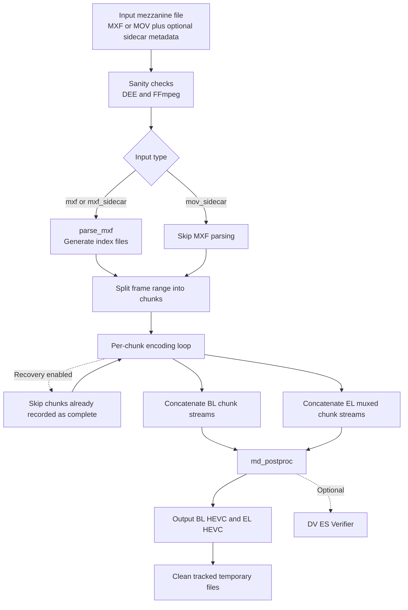
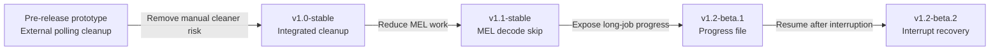
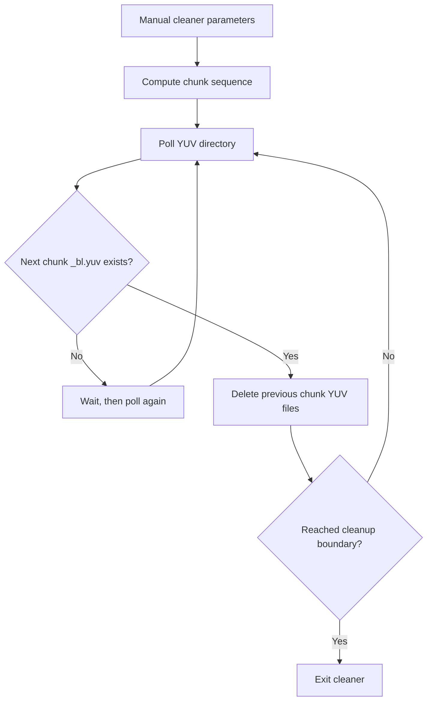

# Dolby Encoding Engine Workflow

Language: English | [简体中文](README_zh-CN.md)

DEE_Workflow is a Dolby Vision Profile 7 dual-layer distributed encoding workflow built around Dolby Encoding Engine (DEE). It extends Dolby's sample `dv_profile_7_workflow_chunked.py` flow for UHD Blu-ray style jobs with integrated YUV cleanup, MEL-specific speed optimization, progress-file monitoring, and interrupt recovery.

The current package is aligned with `v1.2-beta.2`. `Encoder.bat` is intentionally shipped as a template; review every path and remove the leading `::` before using it as an executable batch command.

---

## Contents

- [Dependencies](#dependencies)
- [Repository Layout](#repository-layout)
- [XML Templates and Rate Settings](#xml-templates-and-rate-settings)
- [Quick Start](#quick-start)
- [Core Encoding Flow](#core-encoding-flow)
- [Version Evolution](#version-evolution)
- [YUV_Cleaner.bat Mechanism](#yuv_cleanerbat-mechanism)
- [Command-Line Reference](#command-line-reference)
- [Recovery Notes](#recovery-notes)
- [License](#license)

---

## Dependencies

| Component | Version | Role |
|:---|:---|:---|
| Dolby Encoding Engine (DEE) | 5.2.1 | Core Dolby Vision processing engine used for BL/EL YUV generation, HEVC encoding orchestration, VES muxing, and metadata post-processing. |
| FFmpeg | 7.1.1-full_build-www.gyan.dev | HEVC decoder used to decode BL HEVC back into raw YUV for EL generation in non-optimized paths. |
| Python | 3.13.7 | Workflow runtime for chunk splitting, step scheduling, progress tracking, recovery state, and cleanup. |
| x265 | 3.5 | HEVC encoder invoked through DEE XML templates for BL and EL streams. |

---

## Repository Layout

```text
DEE_Workflow/
|-- Encoder.bat              Template launcher; Python command starts commented with "::".
|-- Progress.txt             Progress monitor output target.
|-- README.md                English documentation.
|-- README_zh-CN.md          Simplified Chinese documentation.
|-- LICENSE
|-- .gitignore               Ignores local release archives, legacy notes, and the workspace file.
|-- Settings/
|   |-- Script_Beta_Master.py
|   |-- Settings_YUV_BL.xml
|   |-- Settings_YUV_EL.xml
|   |-- Settings_x265_BL.xml
|   |-- Settings_x265_EL.xml
|   |-- Settings_vesMux.xml
|   `-- Settings_postProc.xml
```

`Releases/`, `LEGACY_WORKFLOW/`, and `杜比编码引擎工作流.code-workspace` are intentionally ignored. Use those paths only for local release/archive material; the tracked repository layout above is the active workflow package.

---

## XML Templates and Rate Settings

The current release package was built after the project structure was consolidated. Runtime XML paths are resolved from `Settings/Script_Beta_Master.py` through `self.script_dir`, so the packaged workflow uses the XML files under the adjacent `Settings/` directory instead of the legacy shortcut-based layout.

For the x265 HEVC path, `Settings_x265_BL.xml` and `Settings_x265_EL.xml` remain the base DEE templates. The Python workflow then injects per-run values with `--add-elem`, including frame rate, GOP interval, encode pass count, concatenation flag, temp directory, and the active bitrate tuple.

Bitrate and VBV values are selected by the current source in `Config.get_data_rate()` and passed into DEE at encode time. The XML template values are therefore defaults, while the effective values for this release are:

| Use-case type | BL `data_rate` | BL `max_vbv_data_rate` | BL `vbv_buffer_size` | EL `data_rate` | EL `max_vbv_data_rate` | EL `vbv_buffer_size` |
|:---|---:|---:|---:|---:|---:|---:|
| MEL | 99,000 kbps | 99,000 kbps | 109,450 kbps | 500 kbps | 500 kbps | 550 kbps |
| FEL | 85,000 kbps | 85,000 kbps | 93,500 kbps | 14,000 kbps | 14,000 kbps | 16,500 kbps |

For title-specific production settings, calculate the VBV tuple with [LumaVistaLab/DoVi-UHD_VBV_Calculator](https://github.com/LumaVistaLab/DoVi-UHD_VBV_Calculator). Map the calculator result back to `data_rate`, `max_vbv_data_rate`, and `vbv_buffer_size` for the BL/EL entries in `Config.get_data_rate()` or the corresponding x265 XML templates before running the encode.

---

## Quick Start

1. Install or locate DEE, the DEE license file, FFmpeg, Python, and x265.
2. Edit `Encoder.bat` and replace every machine-specific path with your own paths.
3. Set `--start`, `--end`, `--chunk`, `--fps`, and `--gop-size` for the source.
4. For custom production bitrate targets, calculate VBV parameters with [LumaVistaLab/DoVi-UHD_VBV_Calculator](https://github.com/LumaVistaLab/DoVi-UHD_VBV_Calculator), then update the active BL/EL `data_rate`, `max_vbv_data_rate`, and `vbv_buffer_size` values.
5. Keep `--optimize-mel-performance` only for MEL use-cases. Do not use it for FEL.
6. Keep `--progress-monitor ".\Progress.txt"` if you want progress updates after each completed chunk.
7. Keep `--recovery-feature-enabled` if interrupted jobs should resume from the last fully completed chunk.
8. Remove the leading `::` from the Python command in `Encoder.bat`, then run the batch file.

Template command shape:

```bat
python ".\Settings\Script_Beta_Master.py" ^
  --print-all ^
  --dee "C:\Path\To\DolbyEncodingEngine\dee.exe" ^
  --dee-license "C:\Path\To\DolbyEncodingEngine\license.lic" ^
  --ffmpeg "C:\Path\To\ffmpeg.exe" ^
  --input "D:\Source\DoVi_Mezz_ProRes.mov" ^
  --metadata "D:\Source\DoVi_Meta_CMv4.0.xml" ^
  --input-type mov_sidecar ^
  --use-case no_mapping_with_mel ^
  --optimize-mel-performance ^
  --start 0 --end 3599 ^
  --chunk 600 --fps 59.94 --gop-size 60 ^
  --encode-pass-num 2 --preset slower ^
  --temp "X:\DolbyEncodingEngineTemp" ^
  --recovery-feature-enabled ^
  --progress-monitor ".\Progress.txt" ^
  --base-layer "X:\DolbyVisionBluRayUHD\DEE_Workflow\DoViBL.hevc" ^
  --enh-layer "X:\DolbyVisionBluRayUHD\DEE_Workflow\DoViEL.hevc"
```

---

## Core Encoding Flow

### End-to-End Flow


```mermaid
flowchart TD
    A["Input mezzanine file<br/>MXF or MOV plus optional sidecar metadata"] --> B["Sanity checks<br/>DEE and FFmpeg"]
    B --> C{"Input type"}
    C -->|"mxf or mxf_sidecar"| D["parse_mxf<br/>Generate index files"]
    C -->|"mov_sidecar"| E["Skip MXF parsing"]
    D --> F["Split frame range into chunks"]
    E --> F
    F --> G["Per-chunk encoding loop"]
    G -.->|"Recovery enabled"| H["Skip chunks already recorded as complete"]
    H --> G
    G --> I["Concatenate BL chunk streams"]
    G --> J["Concatenate EL muxed chunk streams"]
    I --> K["md_postproc"]
    J --> K
    K --> L["Output BL HEVC and EL HEVC"]
    K -.->|"Optional"| M["DV ES Verifier"]
    L --> N["Clean tracked temporary files"]
```

### Per-Chunk Pipeline

For each chunk, such as `[0, 599]`, the normal pipeline is:


```mermaid
flowchart LR
    S1["1. Generate_bl_yuv<br/>DEE mezzanine to BL YUV"] --> S2["2. Encode_yuv(bl)<br/>DEE plus x265 to BL HEVC"]
    S2 --> S3["3. Decode_bl_hevc<br/>FFmpeg BL HEVC to BL decoded YUV"]
    S3 --> S4["4. Generate_el_yuv<br/>Mezzanine plus BL reference to EL YUV and RPU"]
    S4 --> S5["5. Encode_yuv(el)<br/>DEE plus x265 to EL HEVC"]
    S5 --> S6["6. Vesmux<br/>RPU plus EL HEVC to muxed EL"]
    S6 --> S7["7. Clean_chunk_yuv<br/>Delete large YUV intermediates"]
    S7 --> S8["8. Update_progress<br/>Only with --progress-monitor"]
    S8 --> S9["9. Save_recovery_state<br/>Record completed chunk"]
```

With `--optimize-mel-performance`, step 3 is skipped and `Generate_el_yuv` reuses the original `_bl.yuv` instead of `_bl_decoded.yuv`. The script validates that this option is used only with MEL use-cases.

`Save_recovery_state` is scheduled even when resume loading is not requested. This keeps a recovery JSON available if the process is interrupted; `--recovery-feature-enabled` controls whether an existing recovery file is read on startup.

### Timeline Example

Example: 3600 frames, `--chunk 600`, `--gop-size 60`, six chunks total.

```text
Startup
  sanity_check_dee
  sanity_check_ffmpeg
  Record_start_time                         [when --progress-monitor is set]
  RecoveryManager.try_load or init_new      [recovery JSON in --temp]

Chunk 1 [0, 599]
  Generate_bl_yuv        -> {ts}_0_599_bl.yuv + BL manifest
  Encode_yuv(bl)         -> {ts}_0_599_bl.hevc
  Decode_bl_hevc         -> {ts}_0_599_bl_decoded.yuv
                             skipped by --optimize-mel-performance
  Generate_el_yuv        -> {ts}_0_599_el.yuv + {ts}_0_599_el.rpu + EL manifest
  Encode_yuv(el)         -> {ts}_0_599_el.hevc
  Vesmux                 -> {ts}_0_599_el_muxed.hevc
  Clean_chunk_yuv        -> delete _bl.yuv, _bl_decoded.yuv, _el.yuv
  Update_progress        -> 16.7%
  Save_recovery_state    -> completed_chunks includes [0, 599]

Chunk 2 [600, 1199]
  same pipeline
  Update_progress        -> 33.3%
  Save_recovery_state    -> completed_chunks includes [600, 1199]

Chunks 3-6
  same pipeline
  final progress         -> Done.

Finalization
  Concatenate_chunk_files('bl') -> {ts}_bl_concat.hevc
  Concatenate_chunk_files('el') -> {ts}_el_concat.hevc
  md_postproc                  -> final BL.hevc and EL.hevc
  RecoveryManager.remove       -> delete active .recovery_{ts}.json
  clean_temp                   -> remove remaining tracked intermediates
```

For 4K 10-bit YUV420, one 600-frame chunk can produce several gigabytes of YUV data. Integrated per-chunk cleanup keeps the live YUV footprint close to one active chunk instead of accumulating every chunk.

---

## Version Evolution

### Overview

The project evolved from one pre-release cleanup prototype into the release line used by the current packages. `Releases/` may exist locally as an ignored release archive, but this README describes the tracked active workflow and summarizes the release history below.

| Pain point | Solution | Introduced in |
|:---|:---|:---|
| Large YUV intermediates could exhaust disk space during long encodes. | External polling cleaner prototype. | Pre-release prototype |
| The cleaner needed manual parameters and inferred safety from file existence. | Integrate cleanup into the Python workflow. | v1.0-stable |
| MEL jobs spent time decoding BL HEVC even though the MEL EL bitrate is very low. | Skip BL decoding and reuse original BL YUV for MEL. | v1.1-stable |
| Long jobs had no compact progress signal or ETA. | Write a chunk-based progress file. | v1.2-beta.1 |
| Interruptions forced a full restart or manual recovery. | Save chunk completion state and resume from the last complete chunk. | v1.2-beta.2 |

### Pre-release external cleaner

Goal: reduce disk pressure before changing Dolby's original chunked workflow script.

Approach: run `YUV_Cleaner.bat` as a separate CMD process. The cleaner asks for the frame numbering pattern, a timestamp identifier, and the YUV directory, then polls the filesystem and deletes previous chunk YUV files after it sees the next chunk begin.

| Input | Output |
|:---|:---|
| Mezzanine source, metadata, original workflow parameters, and cleaner-specific manual values. | BL HEVC, EL HEVC, and fewer retained YUV intermediates. |

Main limitation: cleanup was inferred indirectly and could not share state with the Python workflow.

### v1.0-stable

Goal: make YUV cleanup deterministic and remove the second cleaner window.

| Change | Purpose |
|:---|:---|
| `Clean_chunk_yuv` | Deletes `_bl.yuv`, `_bl_decoded.yuv`, and `_el.yuv` after `Vesmux`. |
| `Print_clean_chunk_yuv` | Shows the cleanup action in `--dry-run`. |
| `FileManager.remove_from_tracking()` | Avoids duplicate cleanup later in `clean_temp()`. |
| Workflow scheduling update | Inserts cleanup at the known-safe point after each chunk is consumed. |

Call parameters: no new user parameter. `--keep-temp` continues to preserve intermediates when requested. Inputs and outputs remain BL HEVC and EL HEVC, while disk usage is lower because old chunk YUV files are removed immediately after their final consumer finishes.

### v1.1-stable

Goal: remove a redundant decode step for MEL use-cases.

| Change | Purpose |
|:---|:---|
| `--optimize-mel-performance` | Enables the optimized MEL path. |
| Validation in config parsing | Rejects the option for non-MEL use-cases. |
| Workflow scheduling update | Skips `Decode_bl_hevc` when the option is enabled. |
| `Generate_el_yuv` reference selection | Uses `_bl.yuv` for optimized MEL, otherwise `_bl_decoded.yuv`. |

```text
Default / FEL path:
  Generate_bl_yuv -> Encode_yuv(bl) -> Decode_bl_hevc
  -> Generate_el_yuv using _bl_decoded.yuv -> Encode_yuv(el) -> Vesmux

Optimized MEL path:
  Generate_bl_yuv -> Encode_yuv(bl)
  -> Generate_el_yuv using _bl.yuv -> Encode_yuv(el) -> Vesmux
```

Inputs and outputs are unchanged. The benefit is less decode time and less YUV disk I/O for MEL jobs.

### v1.2-beta.1

Goal: make long encodes observable without parsing the full console log.

| Change | Purpose |
|:---|:---|
| `--progress-monitor FILE` | Chooses the progress output file. |
| `ProgressMonitor` | Tracks total frames, processed frames, elapsed time, and ETA. |
| `Record_start_time` | Writes the initial start time before the first active chunk. |
| `Update_progress` | Rewrites the progress file after each fully completed chunk. |

Progress file shape:

```text
Global Progress Monitor - (C) LumaVista
---------------------------------------
* Updated with the last finished chunk.

Global Progress: 33.3%
Time Elapsed: 01:23:45

Encoder Start Time: 2026/03/30 14:00:00
Estimated End Time: 2026/03/30 18:11:15
```

Inputs and outputs are unchanged, with `Progress.txt` added when the option is used.

### v1.2-beta.2

Goal: resume long encodes after power loss, process termination, or accidental closure.

| Change | Purpose |
|:---|:---|
| `--recovery-feature-enabled` | Allows startup to load an existing `.recovery_*.json`. |
| `RecoveryManager` | Creates, reads, validates, updates, and removes recovery files. |
| `Save_recovery_state` | Records a chunk only after it is fully complete. |
| `Skip_chunk` | Replaces all work for chunks already recorded as complete. |
| Critical-parameter validation | Prevents unsafe resume with mismatched encode settings. |

Recovery file example:

```json
{
  "time_stamp": "20260330140000",
  "critical_params": {
    "use_case": "no_mapping_with_mel",
    "optimize_mel_performance": true,
    "start": 0,
    "end": 3599,
    "chunk": 600,
    "fps": "59.94",
    "gop_size": 60,
    "encode_pass_num": 2,
    "preset": "slower",
    "temp": "X:\\DolbyEncodingEngineTemp"
  },
  "completed_chunks": [[0, 599], [600, 1199]]
}
```

The following values must match before resume: `use_case`, `optimize_mel_performance`, `start`, `end`, `chunk`, `fps`, `gop_size`, `encode_pass_num`, `preset`, and `temp`.

### Evolution Summary


```mermaid
flowchart LR
    P["Pre-release prototype<br/>External polling cleanup"]
    R10["v1.0-stable<br/>Integrated cleanup"]
    R11["v1.1-stable<br/>MEL decode skip"]
    R12b1["v1.2-beta.1<br/>Progress file"]
    R12b2["v1.2-beta.2<br/>Interrupt recovery"]
    P -->|"Remove manual cleaner risk"| R10
    R10 -->|"Reduce MEL work"| R11
    R11 -->|"Expose long-job progress"| R12b1
    R12b1 -->|"Resume after interruption"| R12b2
```

| Version | New command-line option | Main new implementation | Problem solved |
|:---|:---|:---|:---|
| Pre-release prototype | None | `YUV_Cleaner.bat` | Disk pressure from YUV accumulation. |
| v1.0-stable | None | `Clean_chunk_yuv`, `Print_clean_chunk_yuv` | Unsafe external polling cleaner. |
| v1.1-stable | `--optimize-mel-performance` | MEL-aware workflow scheduling and EL reference selection. | Redundant BL decode for MEL. |
| v1.2-beta.1 | `--progress-monitor FILE` | `ProgressMonitor`, `Record_start_time`, `Update_progress` | No concise progress or ETA. |
| v1.2-beta.2 | `--recovery-feature-enabled` | `RecoveryManager`, `Save_recovery_state`, `Skip_chunk` | Full restart after interruption. |

---

## YUV_Cleaner.bat Mechanism

`YUV_Cleaner.bat` belongs to a pre-release external-cleaner prototype and is kept as historical context. It is not required by the current workflow.

The cleaner ran in parallel with the Python encoder. It asked for the first chunk ending frame number, chunk interval, final frame number, timestamp prefix, and YUV directory. Its core heuristic was: once the next chunk's `_bl.yuv` exists, the previous chunk's YUV consumers should have finished, so the previous chunk's `_bl.yuv`, `_bl_decoded.yuv`, and `_el.yuv` can be deleted.


```mermaid
flowchart TD
    A["Manual cleaner parameters"] --> B["Compute chunk sequence"]
    B --> C["Poll YUV directory"]
    C --> D{"Next chunk _bl.yuv exists?"}
    D -->|"No"| E["Wait, then poll again"]
    E --> C
    D -->|"Yes"| F["Delete previous chunk YUV files"]
    F --> G{"Reached cleanup boundary?"}
    G -->|"No"| C
    G -->|"Yes"| H["Exit cleaner"]
```

| Limitation | Impact |
|:---|:---|
| Fixed polling interval | Slow feedback or unnecessary waiting. |
| No shared workflow state | Cleanup safety was inferred from file presence only. |
| Manual frame math | Easy to mistype chunk boundaries. |
| Separate process | Needed a second command window and separate lifecycle. |
| Last chunk handling | Remaining files were left for final cleanup. |

`v1.0-stable` removed these issues by making cleanup a normal workflow step after `Vesmux`.

---

## Command-Line Reference

### Required Parameters

| Parameter | Meaning | Example |
|:---|:---|:---|
| `-u, --use-case` | Encoding use-case. | `no_mapping_with_mel` |
| `-t, --input-type` | Input type: `mxf`, `mxf_sidecar`, or `mov_sidecar`. | `mov_sidecar` |
| `-l, --dee-license` | DEE license file. | `license.lic` |
| `-i, --input` | Input mezzanine file. | `DoVi_Mezz_ProRes.mov` |
| `-g, --gop-size` | GOP size in frames. | `60` |
| `-e, --enh-layer` | Output EL stream path. | `DoViEL.hevc` |
| `-d, --dee` | DEE executable. | `dee.exe` |
| `-c, --chunk` | Chunk size in frames. | `600` |
| `-b, --base-layer` | Output BL stream path. | `DoViBL.hevc` |
| `--temp` | Temporary work directory. | `X:\DolbyEncodingEngineTemp` |
| `--start` | Start frame. | `0` |
| `--end` | End frame. | `3599` |
| `--fps` | Frame rate: `23.976`, `24`, `25`, `50`, `59.94`, or `60`. | `59.94` |

### Optional Parameters

| Parameter | Default | Meaning |
|:---|:---|:---|
| `-p, --encode-pass-num` | `2` | Number of encoder passes per layer. |
| `-m, --metadata` | None | Sidecar metadata file for sidecar input types. |
| `--print-all` | `false` | Print all logs to stdout. |
| `--preset` | Encoder default | Encoder preset or speed mode. |
| `--keep-temp` | `false` | Keep intermediate files. |
| `--ffmpeg` | `ffmpeg` | FFmpeg executable. |
| `--encoder` | `hevc` | Encoder type: `hevc`, `impact`, or `beamr`. |
| `--dvesverifier` | None | Dolby Vision ES Verifier executable. |
| `--dry-run` | `false` | Print commands without executing them. |
| `--optimize-mel-performance` | `false` | Skip BL HEVC decoding for MEL use-cases. |
| `--progress-monitor FILE` | None | Write progress statistics to the specified file. |
| `--recovery-feature-enabled` | `false` | Load existing recovery state and resume when possible. |

### Supported Use-Cases

| Use-case | Type | Active rate profile |
|:---|:---|:---|
| `no_mapping_with_mel` | MEL | MEL: BL 99,000 / 99,000 / 109,450 kbps; EL 500 / 500 / 550 kbps |
| `no_mapping_with_fel` | FEL | FEL: BL 85,000 / 85,000 / 93,500 kbps; EL 14,000 / 14,000 / 16,500 kbps |
| `map_to_1000_nits_with_fel` | FEL | FEL: BL 85,000 / 85,000 / 93,500 kbps; EL 14,000 / 14,000 / 16,500 kbps |
| `map_to_1000_nits_with_mel` | MEL | MEL: BL 99,000 / 99,000 / 109,450 kbps; EL 500 / 500 / 550 kbps |
| `map_to_600_nits_with_fel` | FEL | FEL: BL 85,000 / 85,000 / 93,500 kbps; EL 14,000 / 14,000 / 16,500 kbps |

The three values in each active rate profile are `data_rate`, `max_vbv_data_rate`, and `vbv_buffer_size`.

---

## Recovery Notes

- Recovery files are written under `--temp` as `.recovery_<timestamp>.json`.
- Startup only loads a recovery file when `--recovery-feature-enabled` is present.
- If more than one `.recovery_*.json` exists, the script starts fresh instead of guessing.
- If critical parameters mismatch, the script exits and prints the differences.
- A partially written chunk is intentionally repeated; only fully completed chunks are skipped.
- On successful completion, the active recovery file is deleted.

---

## License

The core Dolby sample workflow is based on the BSD 3-Clause licensed Dolby script copyright (c) 2019 Dolby Laboratories.

The integrated YUV cleanup, MEL optimization, progress monitoring, recovery support, and packaging work are maintained by [LumaVistaLab](https://github.com/LumaVistaLab) for this workflow.
