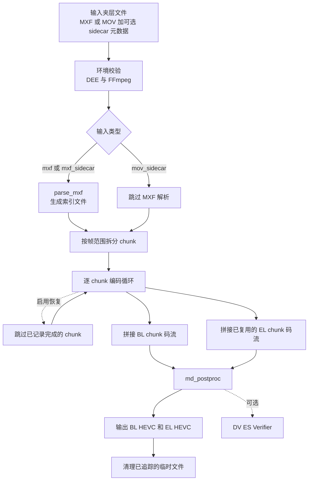
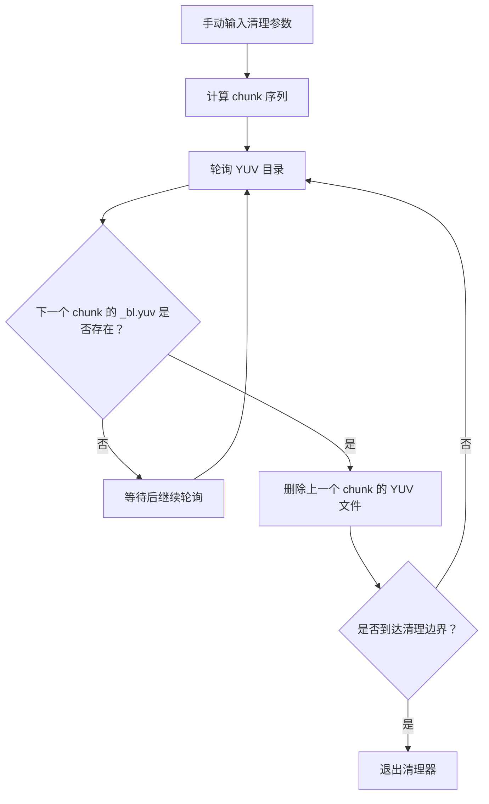

# 杜比编码引擎工作流

语言：简体中文 | [English](README.md)

DEE_Workflow 是基于 Dolby Encoding Engine（DEE）的 Dolby Vision Profile 7 双层分布式编码工作流。本项目在 Dolby 官方 `dv_profile_7_workflow_chunked.py` 示例流程基础上，面向 UHD 蓝光类编码任务增加了集成式 YUV 清理、MEL 专用性能优化、进度文件监控和中断恢复能力。

当前包对应 `v1.2-beta.2`。`Encoder.bat` 以模板形式随包提供；使用前请检查所有路径，并移除 Python 命令行开头的 `::`，否则该命令仍处于注释状态。

---

## 目录

- [依赖组件](#依赖组件)
- [项目结构](#项目结构)
- [XML 模板与码率设置](#xml-模板与码率设置)
- [快速开始](#快速开始)
- [核心编码流程](#核心编码流程)
- [版本演进](#版本演进)
- [YUV_Cleaner.bat 工作机制](#yuv_cleanerbat-工作机制)
- [调用参数参考](#调用参数参考)
- [恢复机制说明](#恢复机制说明)
- [许可证](#许可证)

---

## 依赖组件

| 组件 | 版本 | 用途 |
|:---|:---|:---|
| Dolby Encoding Engine (DEE) | 5.2.1 | Dolby Vision 处理核心，用于 BL/EL YUV 生成、HEVC 编码调度、VES 复用和元数据后处理。 |
| FFmpeg | 7.1.1-full_build-www.gyan.dev | HEVC 解码器；在未启用 MEL 优化时，将 BL HEVC 解码为原始 YUV 供 EL 生成使用。 |
| Python | 3.13.7 | 工作流运行时，负责 chunk 拆分、步骤编排、进度跟踪、恢复状态和清理逻辑。 |
| x265 | 3.5 | HEVC 编码器，由 DEE 通过 XML 模板调用，生成 BL 和 EL 码流。 |

---

## 项目结构

```text
DEE_Workflow/
|-- Encoder.bat              当前工作流的模板启动脚本，Python 命令默认以 "::" 注释。
|-- Progress.txt             进度监控输出文件。
|-- README.md                英文文档。
|-- README_zh-CN.md          简体中文文档。
|-- LICENSE
|-- .gitignore               排除本地发布归档、历史工作流资料和工作区文件。
|-- Settings/
|   |-- Script_Beta_Master.py
|   |-- Settings_YUV_BL.xml
|   |-- Settings_YUV_EL.xml
|   |-- Settings_x265_BL.xml
|   |-- Settings_x265_EL.xml
|   |-- Settings_vesMux.xml
|   `-- Settings_postProc.xml
```

`Releases/`、`LEGACY_WORKFLOW/` 和 `杜比编码引擎工作流.code-workspace` 已被 `.gitignore` 有意排除。它们只用于本地发布包、历史资料或编辑器工作区；上方结构描述的是受跟踪的活动工作流包。

---

## XML 模板与码率设置

当前发布包是在项目结构重整后构建的。运行时 XML 路径由 `Settings/Script_Beta_Master.py` 通过 `self.script_dir` 解析，因此打包工作流使用相邻 `Settings/` 目录下的 XML 文件，不再依赖旧版备份中的快捷方式式布局。

在 x265 HEVC 路径中，`Settings_x265_BL.xml` 和 `Settings_x265_EL.xml` 仍是 DEE 的基础模板。Python 工作流随后通过 `--add-elem` 注入本次运行的帧率、GOP 间隔、编码 pass 数、拼接标志、临时目录以及当前生效的码率三元组。

码率和 VBV 值由当前源码中的 `Config.get_data_rate()` 按 use-case 类型选择，并在编码时传给 DEE。因此 XML 模板中的数值是基础默认值；本发布版本实际生效的值如下：

| Use-case 类型 | BL `data_rate` | BL `max_vbv_data_rate` | BL `vbv_buffer_size` | EL `data_rate` | EL `max_vbv_data_rate` | EL `vbv_buffer_size` |
|:---|---:|---:|---:|---:|---:|---:|
| MEL | 99,000 kbps | 99,000 kbps | 109,450 kbps | 500 kbps | 500 kbps | 550 kbps |
| FEL | 85,000 kbps | 85,000 kbps | 93,500 kbps | 14,000 kbps | 14,000 kbps | 16,500 kbps |

正式压制时如需按片源重新计算目标 VBV 参数，请使用 [LumaVistaLab/DoVi-UHD_VBV_Calculator](https://github.com/LumaVistaLab/DoVi-UHD_VBV_Calculator) 提供的方法。计算结果应映射回 BL/EL 的 `data_rate`、`max_vbv_data_rate` 和 `vbv_buffer_size`，再更新 `Config.get_data_rate()` 中的生效三元组或对应 x265 XML 模板后运行编码。

---

## 快速开始

1. 安装或定位 DEE、DEE 许可证、FFmpeg、Python 和 x265。
2. 编辑 `Encoder.bat`，将所有机器相关路径替换为当前环境中的真实路径。
3. 按源文件设置 `--start`、`--end`、`--chunk`、`--fps` 和 `--gop-size`。
4. 如需针对正式压制目标重新设置码率，请使用 [LumaVistaLab/DoVi-UHD_VBV_Calculator](https://github.com/LumaVistaLab/DoVi-UHD_VBV_Calculator) 计算 VBV 参数，再更新生效的 BL/EL `data_rate`、`max_vbv_data_rate` 和 `vbv_buffer_size`。
5. 如果任务是 MEL，保留 `--optimize-mel-performance`；FEL 用例不要使用该参数。
6. 如需在编码过程中查看粗粒度进度，保留 `--progress-monitor ".\Progress.txt"`。
7. 如需中断后从最后一个完整 chunk 继续，保留 `--recovery-feature-enabled`。
8. 移除 `Encoder.bat` 中 Python 命令前的 `::`，然后运行批处理文件。

模板命令形态：

```bat
python ".\Settings\Script_Beta_Master.py" ^
  --print-all ^
  --dee "C:\Path\To\DolbyEncodingEngine\dee.exe" ^
  --dee-license "C:\Path\To\DolbyEncodingEngine\license.lic" ^
  --ffmpeg "C:\Path\To\ffmpeg.exe" ^
  --input "D:\Source\DoVi_Mezz_ProRes.mov" ^
  --metadata "D:\Source\DoVi_Meta_CMv4.0.xml" ^
  --input-type mov_sidecar ^
  --use-case no_mapping_with_mel ^
  --optimize-mel-performance ^
  --start 0 --end 3599 ^
  --chunk 600 --fps 59.94 --gop-size 60 ^
  --encode-pass-num 2 --preset slower ^
  --temp "X:\DolbyEncodingEngineTemp" ^
  --recovery-feature-enabled ^
  --progress-monitor ".\Progress.txt" ^
  --base-layer "X:\DolbyVisionBluRayUHD\DEE_Workflow\DoViBL.hevc" ^
  --enh-layer "X:\DolbyVisionBluRayUHD\DEE_Workflow\DoViEL.hevc"
```

---

## 核心编码流程

### 整体流程



### Chunk 内部流水线

对每个 chunk（例如 `[0, 599]`），常规流水线如下：


启用 `--optimize-mel-performance` 时，步骤 3 会被跳过，`Generate_el_yuv` 直接复用原始 `_bl.yuv`，而不是 `_bl_decoded.yuv`。脚本会校验该参数只能用于 MEL 用例。

`Save_recovery_state` 是当前流水线的一部分，即使本次启动不读取恢复文件，也会写入恢复 JSON。`--recovery-feature-enabled` 控制的是启动时是否尝试读取既有恢复文件。

### 处理时序示例

示例：3600 帧、`--chunk 600`、`--gop-size 60`，共 6 个 chunk。

```text
启动阶段
  sanity_check_dee
  sanity_check_ffmpeg
  Record_start_time                         [设置 --progress-monitor 时]
  RecoveryManager.try_load 或 init_new      [在 --temp 中维护恢复 JSON]

Chunk 1 [0, 599]
  Generate_bl_yuv        -> {ts}_0_599_bl.yuv + BL manifest
  Encode_yuv(bl)         -> {ts}_0_599_bl.hevc
  Decode_bl_hevc         -> {ts}_0_599_bl_decoded.yuv
                             启用 --optimize-mel-performance 时跳过
  Generate_el_yuv        -> {ts}_0_599_el.yuv + {ts}_0_599_el.rpu + EL manifest
  Encode_yuv(el)         -> {ts}_0_599_el.hevc
  Vesmux                 -> {ts}_0_599_el_muxed.hevc
  Clean_chunk_yuv        -> 删除 _bl.yuv、_bl_decoded.yuv、_el.yuv
  Update_progress        -> 16.7%
  Save_recovery_state    -> completed_chunks 记录 [0, 599]

Chunk 2 [600, 1199]
  同上流水线
  Update_progress        -> 33.3%
  Save_recovery_state    -> completed_chunks 记录 [600, 1199]

Chunk 3-6
  同上流水线
  最终进度               -> Done.

收尾阶段
  Concatenate_chunk_files('bl') -> {ts}_bl_concat.hevc
  Concatenate_chunk_files('el') -> {ts}_el_concat.hevc
  md_postproc                  -> 最终 BL.hevc 和 EL.hevc
  RecoveryManager.remove       -> 删除当前 .recovery_{ts}.json
  clean_temp                   -> 删除剩余已追踪中间文件
```

对于 4K 10-bit YUV420，一个 600 帧 chunk 可产生数 GB 级 YUV 数据。集成式逐 chunk 清理能让实时 YUV 占用接近一个活跃 chunk，而不是累积所有 chunk。

---

## 版本演进

### 总述

项目从一个预发布清理器原型演进到当前发布包所使用的版本线。`Releases/` 如在本地存在，应作为被忽略的发布归档目录；本文档只描述受跟踪的活动工作流，并在下方总结版本演进。

| 痛点 | 解决方案 | 引入版本 |
|:---|:---|:---|
| 长视频编码时大型 YUV 中间文件可能耗尽磁盘空间。 | 外部轮询清理器原型。 | 预发布原型 |
| 清理器需要手动参数，并通过文件存在性间接推断安全时机。 | 将清理集成进 Python 工作流。 | v1.0-stable |
| MEL 任务仍执行 BL HEVC 解码，存在冗余耗时。 | MEL 下跳过 BL 解码并复用原始 BL YUV。 | v1.1-stable |
| 长时间任务缺乏简洁进度和 ETA。 | 输出基于 chunk 的进度文件。 | v1.2-beta.1 |
| 意外中断后需要重头开始或手动恢复。 | 保存 chunk 完成状态并从最后完成点继续。 | v1.2-beta.2 |

### 预发布外部清理器

目标：在不修改 Dolby 原始 chunked workflow 脚本的前提下缓解磁盘压力。

方案：并行运行 `YUV_Cleaner.bat`。清理器要求用户输入帧编号模式、时间戳标识符和 YUV 目录，然后轮询文件系统；当它看到下一个 chunk 开始时，删除上一个 chunk 的 YUV 文件。

| 输入 | 输出 |
|:---|:---|
| 夹层源、元数据、原始工作流参数，以及清理器专用手动参数。 | BL HEVC、EL HEVC，以及更少保留的 YUV 中间文件。 |

主要局限：清理安全性来自间接推断，无法和 Python 工作流共享状态。

### v1.0-stable

目标：让 YUV 清理时机确定化，并移除第二个清理窗口。

| 改动 | 用途 |
|:---|:---|
| `Clean_chunk_yuv` | 在 `Vesmux` 后删除 `_bl.yuv`、`_bl_decoded.yuv` 和 `_el.yuv`。 |
| `Print_clean_chunk_yuv` | 在 `--dry-run` 中展示清理动作。 |
| `FileManager.remove_from_tracking()` | 避免后续 `clean_temp()` 重复清理。 |
| Workflow 编排更新 | 在每个 chunk 被完整消费后插入清理步骤。 |

调用参数：没有新增用户参数。设置 `--keep-temp` 时仍会保留中间文件。输入输出仍为 BL HEVC 和 EL HEVC；区别是旧 chunk 的 YUV 会在最终消费者完成后立即删除，降低磁盘占用。

### v1.1-stable

目标：移除 MEL 用例中的冗余解码步骤。

| 改动 | 用途 |
|:---|:---|
| `--optimize-mel-performance` | 启用 MEL 优化路径。 |
| 配置解析校验 | 禁止在非 MEL 用例使用该参数。 |
| Workflow 编排更新 | 启用该参数时跳过 `Decode_bl_hevc`。 |
| `Generate_el_yuv` 参考选择 | 优化 MEL 使用 `_bl.yuv`，否则使用 `_bl_decoded.yuv`。 |

```text
默认 / FEL 路径：
  Generate_bl_yuv -> Encode_yuv(bl) -> Decode_bl_hevc
  -> Generate_el_yuv 使用 _bl_decoded.yuv -> Encode_yuv(el) -> Vesmux

优化 MEL 路径：
  Generate_bl_yuv -> Encode_yuv(bl)
  -> Generate_el_yuv 使用 _bl.yuv -> Encode_yuv(el) -> Vesmux
```

输入输出不变。收益是 MEL 任务减少解码耗时和 YUV 磁盘 I/O。

### v1.2-beta.1

目标：无需阅读完整控制台日志，也能观察长时间编码任务。

| 改动 | 用途 |
|:---|:---|
| `--progress-monitor FILE` | 指定进度输出文件。 |
| `ProgressMonitor` | 跟踪总帧数、已处理帧数、已用时间和 ETA。 |
| `Record_start_time` | 在第一个有效 chunk 前写入启动时间。 |
| `Update_progress` | 每个完整 chunk 完成后重写进度文件。 |

进度文件形态：

```text
Global Progress Monitor - (C) LumaVista
---------------------------------------
* Updated with the last finished chunk.

Global Progress: 33.3%
Time Elapsed: 01:23:45

Encoder Start Time: 2026/03/30 14:00:00
Estimated End Time: 2026/03/30 18:11:15
```

编码输入输出不变；使用该参数时额外生成 `Progress.txt`。

### v1.2-beta.2

目标：在断电、进程终止或误关闭后继续长时间编码任务。

| 改动 | 用途 |
|:---|:---|
| `--recovery-feature-enabled` | 允许启动时加载既有 `.recovery_*.json`。 |
| `RecoveryManager` | 创建、读取、校验、更新和删除恢复文件。 |
| `Save_recovery_state` | 仅在 chunk 完整完成后记录该 chunk。 |
| `Skip_chunk` | 将已记录完成的 chunk 替换为空操作。 |
| 关键参数校验 | 防止在编码设置不一致时错误恢复。 |

恢复文件示例：

```json
{
  "time_stamp": "20260330140000",
  "critical_params": {
    "use_case": "no_mapping_with_mel",
    "optimize_mel_performance": true,
    "start": 0,
    "end": 3599,
    "chunk": 600,
    "fps": "59.94",
    "gop_size": 60,
    "encode_pass_num": 2,
    "preset": "slower",
    "temp": "X:\\DolbyEncodingEngineTemp"
  },
  "completed_chunks": [[0, 599], [600, 1199]]
}
```

恢复前必须一致的参数包括：`use_case`、`optimize_mel_performance`、`start`、`end`、`chunk`、`fps`、`gop_size`、`encode_pass_num`、`preset` 和 `temp`。

### 演进总结


| 版本 | 新增命令行参数 | 主要新增实现 | 解决的问题 |
|:---|:---|:---|:---|
| 预发布原型 | 无 | `YUV_Cleaner.bat` | YUV 累积导致磁盘压力。 |
| v1.0-stable | 无 | `Clean_chunk_yuv`、`Print_clean_chunk_yuv` | 外部轮询清理不安全。 |
| v1.1-stable | `--optimize-mel-performance` | MEL 感知的 workflow 编排与 EL 参考选择。 | MEL 下 BL 解码冗余。 |
| v1.2-beta.1 | `--progress-monitor FILE` | `ProgressMonitor`、`Record_start_time`、`Update_progress` | 缺少简洁进度与 ETA。 |
| v1.2-beta.2 | `--recovery-feature-enabled` | `RecoveryManager`、`Save_recovery_state`、`Skip_chunk` | 中断后需要从头重编。 |

---

## YUV_Cleaner.bat 工作机制

`YUV_Cleaner.bat` 属于预发布外部清理器原型，是历史背景；当前工作流不再需要它。

该清理器与 Python 编码器并行运行，要求用户输入第一个 chunk 的结束帧号、chunk 间隔、最后一帧帧号、生成 YUV 文件名使用的时间戳前缀和 YUV 目录。核心判断是：当下一个 chunk 的 `_bl.yuv` 出现时，推断上一个 chunk 的 YUV 消费者已经完成，因此可以删除上一个 chunk 的 `_bl.yuv`、`_bl_decoded.yuv` 和 `_el.yuv`。



| 局限 | 影响 |
|:---|:---|
| 固定轮询间隔 | 反馈慢或产生不必要等待。 |
| 无共享工作流状态 | 清理安全性只能通过文件存在性推断。 |
| 手动计算帧编号 | 容易输错 chunk 边界。 |
| 独立进程 | 需要第二个命令窗口和独立生命周期。 |
| 最后一个 chunk 处理 | 剩余文件留给最终清理。 |

`v1.0-stable` 通过把清理变成 `Vesmux` 后的正常工作流步骤，移除了这些问题。

---

## 调用参数参考

### 必选参数

| 参数 | 含义 | 示例 |
|:---|:---|:---|
| `-u, --use-case` | 编码用例。 | `no_mapping_with_mel` |
| `-t, --input-type` | 输入类型：`mxf`、`mxf_sidecar` 或 `mov_sidecar`。 | `mov_sidecar` |
| `-l, --dee-license` | DEE 许可证文件。 | `license.lic` |
| `-i, --input` | 输入夹层文件。 | `DoVi_Mezz_ProRes.mov` |
| `-g, --gop-size` | GOP 大小，单位为帧。 | `60` |
| `-e, --enh-layer` | 输出 EL 码流路径。 | `DoViEL.hevc` |
| `-d, --dee` | DEE 可执行文件。 | `dee.exe` |
| `-c, --chunk` | Chunk 大小，单位为帧。 | `600` |
| `-b, --base-layer` | 输出 BL 码流路径。 | `DoViBL.hevc` |
| `--temp` | 临时工作目录。 | `X:\DolbyEncodingEngineTemp` |
| `--start` | 起始帧。 | `0` |
| `--end` | 结束帧。 | `3599` |
| `--fps` | 帧率：`23.976`、`24`、`25`、`50`、`59.94` 或 `60`。 | `59.94` |

### 可选参数

| 参数 | 默认值 | 含义 |
|:---|:---|:---|
| `-p, --encode-pass-num` | `2` | 每层编码 pass 数。 |
| `-m, --metadata` | 无 | sidecar 输入类型使用的元数据文件。 |
| `--print-all` | `false` | 将完整日志打印到 stdout。 |
| `--preset` | 编码器默认值 | 编码器预设或速度模式。 |
| `--keep-temp` | `false` | 保留中间文件。 |
| `--ffmpeg` | `ffmpeg` | FFmpeg 可执行文件。 |
| `--encoder` | `hevc` | 编码器类型：`hevc`、`impact` 或 `beamr`。 |
| `--dvesverifier` | 无 | Dolby Vision ES Verifier 可执行文件。 |
| `--dry-run` | `false` | 只打印命令，不执行。 |
| `--optimize-mel-performance` | `false` | MEL 用例中跳过 BL HEVC 解码。 |
| `--progress-monitor FILE` | 无 | 将进度统计写入指定文件。 |
| `--recovery-feature-enabled` | `false` | 尽可能读取既有恢复状态并继续。 |

### 支持的 use-case

| Use-case | 类型 | 生效码率配置 |
|:---|:---|:---|
| `no_mapping_with_mel` | MEL | MEL：BL 99,000 / 99,000 / 109,450 kbps；EL 500 / 500 / 550 kbps |
| `no_mapping_with_fel` | FEL | FEL：BL 85,000 / 85,000 / 93,500 kbps；EL 14,000 / 14,000 / 16,500 kbps |
| `map_to_1000_nits_with_fel` | FEL | FEL：BL 85,000 / 85,000 / 93,500 kbps；EL 14,000 / 14,000 / 16,500 kbps |
| `map_to_1000_nits_with_mel` | MEL | MEL：BL 99,000 / 99,000 / 109,450 kbps；EL 500 / 500 / 550 kbps |
| `map_to_600_nits_with_fel` | FEL | FEL：BL 85,000 / 85,000 / 93,500 kbps；EL 14,000 / 14,000 / 16,500 kbps |

每组生效码率配置中的三个数值依次为 `data_rate`、`max_vbv_data_rate` 和 `vbv_buffer_size`。

---

## 恢复机制说明

- 恢复文件位于 `--temp` 目录，命名为 `.recovery_<timestamp>.json`。
- 只有传入 `--recovery-feature-enabled` 时，启动阶段才会读取恢复文件。
- 如果存在多个 `.recovery_*.json`，脚本不会猜测目标文件，而是重新开始。
- 如果关键参数不一致，脚本会退出并打印差异。
- 部分写入的 chunk 会被有意重新执行；只有完整完成的 chunk 才会跳过。
- 编码成功完成后，当前恢复文件会被删除。

---

## 许可证

核心 Dolby 示例工作流基于 BSD 3-Clause 许可的 Dolby 脚本，Copyright (c) 2019 Dolby Laboratories。

集成式 YUV 清理、MEL 优化、进度监控、中断恢复和打包工作由 [LumaVistaLab](https://github.com/LumaVistaLab) 为本工作流维护。
